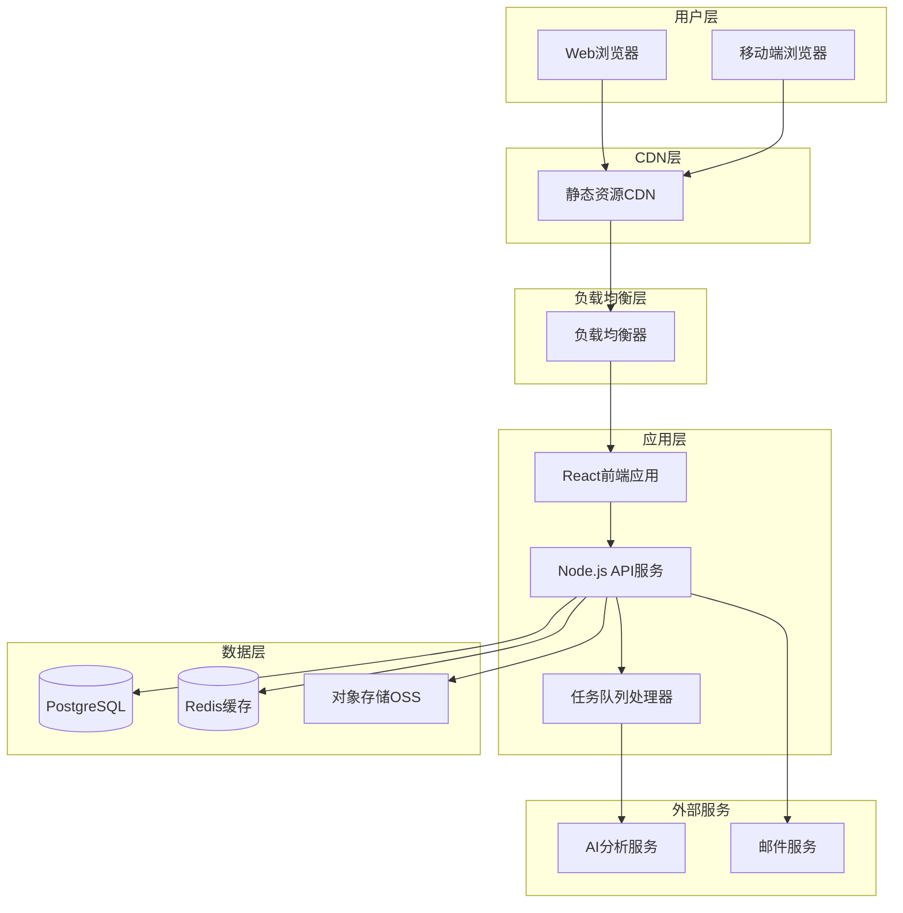

# 系统架构图

```mermaid
graph TB
    subgraph "用户层"
        Web[Web浏览器]
        Mobile[移动端浏览器]
    end
    
    subgraph "CDN层"
        CDN[静态资源CDN]
    end
    
    subgraph "负载均衡层"
        LB[负载均衡器]
    end
    
    subgraph "应用层"
        Frontend[React前端应用]
        API[Node.js API服务]
        TaskQueue[任务队列处理器]
    end
    
    subgraph "数据层"
        PostgresDB[(PostgreSQL)]
        RedisCache[(Redis缓存)]
        FileStorage[对象存储OSS]
    end
    
    subgraph "外部服务"
        AIService[AI分析服务]
        EmailService[邮件服务]
    end
    
    Web --> CDN
    Mobile --> CDN
    CDN --> LB
    LB --> Frontend
    Frontend --> API
    API --> PostgresDB
    API --> RedisCache
    API --> FileStorage
    API --> TaskQueue
    TaskQueue --> AIService
    API --> EmailService
```